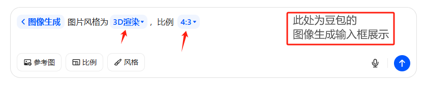

# MentionSender 提及输入框 🦥

## 介绍

`MentionSender` 是用于聊天的输入框组件。

::: warning
他和 `Sender` 组件的功能基本一样，唯一的区别就是 `指令的弹框` **相关的属性和方法** 不同。点击此处快速了解区别 👉 [**指令区别**](https://element-plus-x.com/components/mentionSender/#packages-vue-element-plus-x-src-mentionSender-demos-options)
:::

我们暂时没有考虑将 `MentionSender` 和 `Sender` 两个 **指令功能** 放到一起，仅仅通过组件进行区分。后续我们会在考虑将两个功能合并到另一个新的组件中： `EditorSender` 富文本输入框组件，去支持更多的输入框需求。

::: tip
`EditorSender` 富文本框输入组件，将参考豆包的输入框，在未来和大家见面：

:::

## 代码使用

<demo src="./demos/basic.vue"></demo>

<demo src="./demos/placeholder.vue"></demo>

<demo src="./demos/v-model.vue"></demo>

<demo src="./demos/submit-btn-disabled.vue"></demo>

<demo src="./demos/autosize.vue"></demo>

<demo src="./demos/state.vue"></demo>

<demo src="./demos/submit-type.vue"></demo>

<demo src="./demos/allow-speech.vue"></demo>

<demo src="./demos/action-list.vue"></demo>

<demo src="./demos/prefix.vue"></demo>

<demo src="./demos/header.vue"></demo>

<demo src="./demos/focus.vue"></demo>

<demo src="./demos/variant.vue"></demo>

<demo src="./demos/footer.vue"></demo>

<demo src="./demos/input-style.vue"></demo>

::: warning
下面展示和 `Sender` 组件 **不一样** 的指令相关 **属性方法**。使用时请注意 **使用区别**

此温馨提示更新时间：`2025-04-16`
:::

<demo src="./demos/options.vue"></demo>

<demo src="./demos/trigger-strings.vue"></demo>

<demo src="./demos/trigger-split.vue"></demo>

<demo src="./demos/trigger-loading.vue"></demo>

<demo src="./demos/filter-option.vue"></demo>

<demo src="./demos/whole.vue"></demo>

<demo src="./demos/trigger-popover-placement.vue"></demo>

<demo src="./demos/trigger-popover-offset.vue"></demo>

<demo src="./demos/solts.vue"></demo>

<demo src="./demos/search.vue"></demo>

<demo src="./demos/select.vue"></demo>

## 属性

| 属性名        | 类型    | 是否必填  |  默认值    | 说明     |
| ------------- | ------- | ----- | ------------ | ---------------------------------------------------------------- |
| `v-model` | String  | 否 | ''           | 输入框的绑定值，使用 `v-model` 进行双向绑定。              |
| `placeholder` | String  | 否| ''           | 输入框的提示语文本。                                             |
| `auto-size` | Object | 否 | \{ minRows:1, maxRows:6 \}    |设置输入框的最小展示行数和最大展示行数。      |
| `read-only` | Boolean | 否 |  false        | 输入框是否为只读状态。                                             |
| `disabled`    | Boolean | 否 | false        | 输入框是否为禁用状态。                                             |
| `submitBtnDisabled` v1.1.6版本新增    | Boolean \| undefined | 否 | undefined        | 内置发送按钮禁用状态。(注意使用场景)     |
| `loading`     | Boolean | 否 | false        | 是否显示加载状态。为 `true` 时，输入框会显示加载动画。           |
| `clearable`   | Boolean | 否 | false        | 输入框是否可清空内容。展示默认清空按钮          |
| `allowSpeech` | Boolean | 否 | false        | 是否允许语音输入。默认展示内置语音识别按钮,内置浏览器内置语音识别 API      |
| `submitType`  | String  | 否 | 'enter' | 提交方式，支持 `'shiftEnter'`（按 `Shift + Enter` 提交）。 |
| `headerAnimationTimer` | Number | 否 | 300 | 输入框的自定义头部显示时长，单位为 `ms`。 |
| `inputWidth` | String |否 | '100%' | 输入框的宽度。 |
| `variant` v1.1.6版本新增 | String | 否 | 'default' | 输入框的变体类型，支持 `'default'`、`'updown'`。 |
| `showUpdown` v1.1.6版本新增 | Boolean | 否 | true | 当变体为 `updown` 时，是否展示内置样式。 |
| `inputStyle` v1.1.6版本新增 | Object | 否 | \{} | 输入框的样式。 |
| `triggerStrings` v1.1.6版本新增 | string[] | 否 | [] | 触发指令的 `字符串数组`。 |
| `triggerPopoverVisible` v1.1.6版本新增 | Boolean | 否 | false | 触发指令的 `弹框` 是否可见。需要使用  `v-model:triggerPopoverVisible` 进行控制。 |
| `triggerPopoverWidth v1.1.6版本新增` | String | 否 | 'fit-content' | 触发指令的 `弹框` 的宽度。可使用百分比等css单位。 |
| `triggerPopoverLeft` v1.1.6版本新增 | String | 否 | '0px' | 触发指令的 `弹框` 的左边距。可使用百分比等css单位。 |
| `triggerPopoverOffset` v1.1.6版本新增 | Number | 否 | 8 | 触发指令的 `弹框` 的左边距。只能是数字类型，单位px |
| `triggerPopoverPlacement` v1.1.6版本新增 | String | 否 | 'top-start' | 触发指令的 `弹框` 的位置。取值：`'top'` \| `'top-start'` \| `'top-end'` \| `'bottom'` \| `'bottom-start'` \| `'bottom-end'` \| `'left'` \| `'left-start'` \| `'left-end'` \| `'right'` \| `'right-start'` \| `'right-end'` |

## 事件

| 事件名   | 说明                       | 回调参数 |
| -------- | -------------------------- | -------- |
| `submit` | 内置 `提交按钮` 提交时触发的事件。 | 无       |
| `cancel` | 内置 `loading按钮` 点击时触发的事件。 | 无       |
| `recordingChange` | 内置语音识别状态变化时触发的事件。 | 无       |
| `trigger` v1.1.6版本新增 | 指令弹框发生变化时触发的事件。 | `interface TriggerEvent{oldValue: string; newValue: string; isOpen: boolean; }`       |

## Ref 实例方法

| 属性名       | 类型         | 描述                                         |
| ----------- | ------------ | -------------------------------------------- |
| `openHeader` | Function | 打开输入框的自定义头部。                      |
| `closeHeader`   | Function | 关闭输入框的自定义头部。                    |
| `clear`   | Function | 清空输入框的内容。                               |
| `blur`   | Function | 移除输入框的焦点。                              |
| `focus` | Function | 聚焦输入框。 默认 `focus('all')` 聚焦整个文本，`focus('start')` 聚焦文本最前方，`focus('end')` 聚焦文本最后方。       |
| `submit`  | Function |  提交输入内容。            |
| `cancel`  | Function | 取消加载状态。   |
| `startRecognition` | Function | 开始语音识别。   |
| `stopRecognition` | Function | 停止语音识别。   |

## 插槽

| 插槽名       | 参数  | 类型       | 描述                                         |
| ------------ | ------------ |--- | -------------------------------------------- |
| `#header` | - | Slot | 用于自定义输入框的头部内容。 |
| `#prefix` | - | Slot | 用于自定义输入框的前缀内容。 |
| `#action-list` | - | Slot | 用于自定义输入框的操作列表内容。 |
| `#footer` v1.1.6版本新增 | - | Slot | 用于自定义输入框的尾部内容。 |

## 功能特性

1. **焦点控制**：支持将焦点设置到文本最前方、最后方或选中整个文本，也可取消焦点。
2. **自定义内容**：提供头部、前缀、操作列表等插槽，允许用户自定义这些部分的内容。
3. **提交功能**：支持按 `Shift + Enter` 提交输入内容，提交后可执行自定义操作。
4. **加载状态**：可显示加载状态，模拟提交处理过程。
5. **语音输入**：支持语音输入功能，提升输入的便捷性。
6. **清空功能**：输入框可清空内容，方便用户重新输入。
